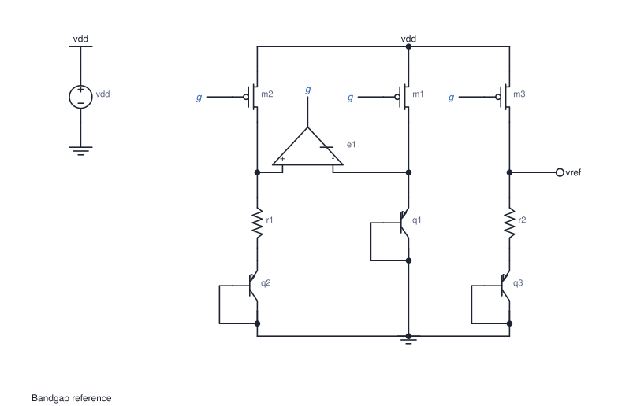
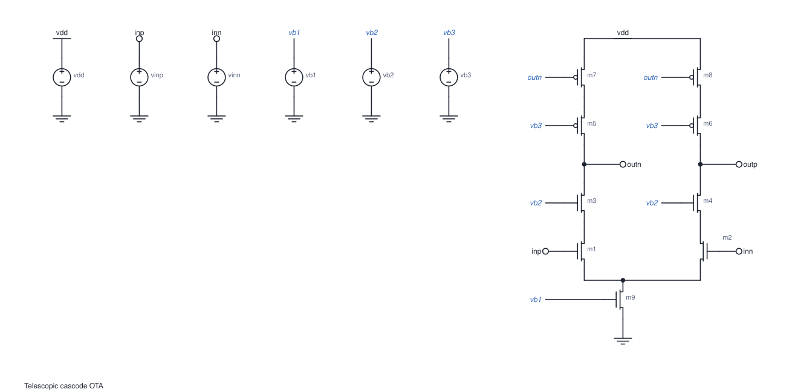
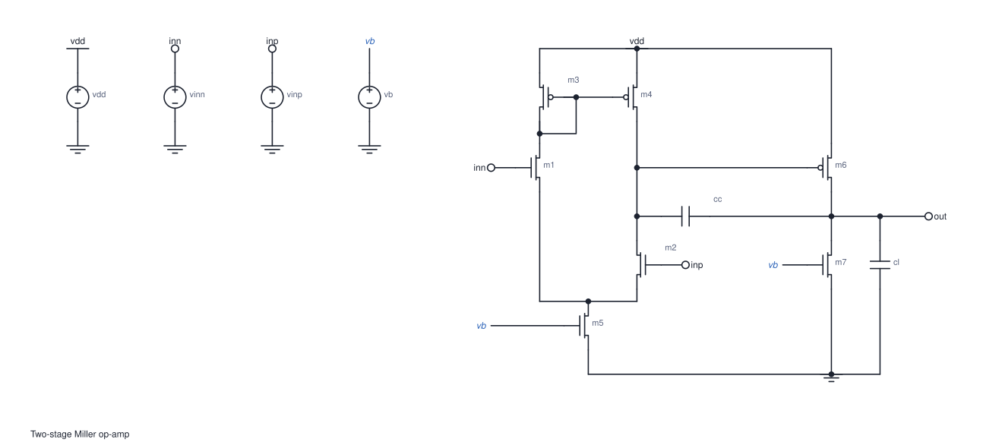
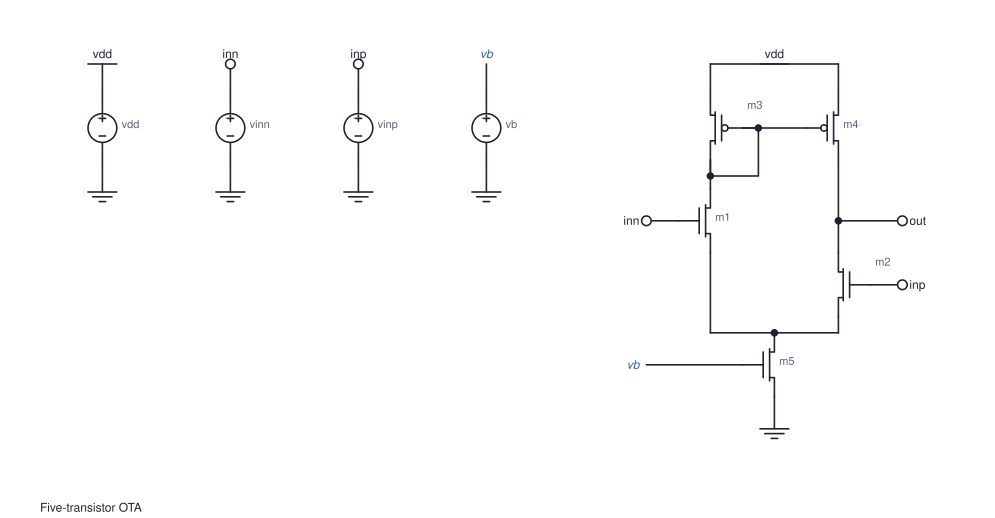
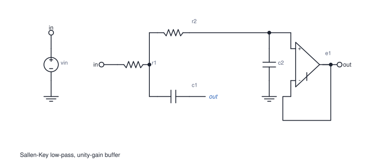
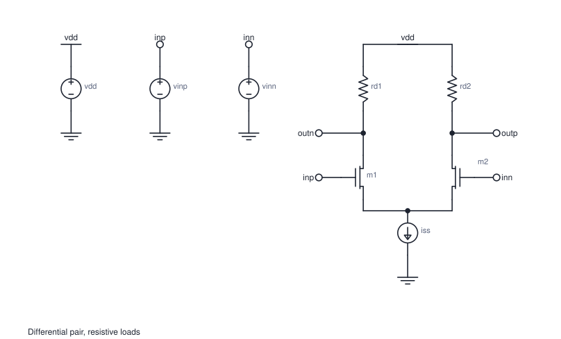
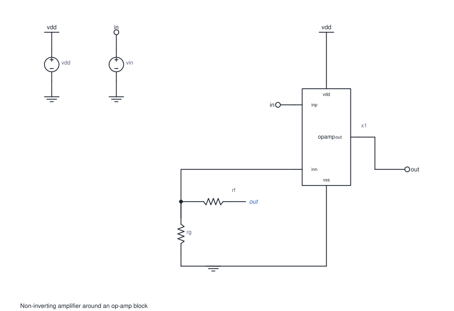

# NetlistParser

SPICE netlist in, placed schematic out: devices at integer points with an
orientation, every pin's point, wires as polylines per net, junction dots,
net labels and no-connect marks laid out the way textbooks draw circuits
(supply at the top, ground at the bottom, signal left to right).

The library draws nothing and knows no device. The application says what each
device class looks like (terminal anchors and body strokes) and reads the
result to write its own format. Its public boundaries follow cktImg's; see
`docs/API.md`.

```zig
const np = @import("NetlistParser");

var lib = np.Library.init(gpa);                 // your symbols
defer lib.deinit();
try lib.loadZon(arena, symbols_zon, &diags);    // e.g. tests/symbols.zon

var placed = try np.place(gpa, &np.Config.default, &lib, &.{spice_text}, &diag);
defer placed.deinit();
// placed.dev_pos, .dev_orient, .pin_xy, .segments(net), .junctions, .labels, …
```

## Examples

Drawn by the library, untouched, with the tests' symbol set
(`zig build gallery -- --svgs out/` makes all of them).

**Bandgap reference.** Three mirrored PMOS branches and an op-amp between
the first two. The shared gate line `g` is labelled, because wiring it
would have to cross the branches.



**Telescopic cascode OTA.** Two stacked columns of five transistors that stay
level, with bias lines as labels.



**Two-stage Miller op-amp.** Mirror load, tail source, second stage and
the compensation capacitor across it.



**Five-transistor OTA.**



**Sallen-Key low-pass with a unity-gain buffer.** The feedback capacitor's
far end is named `out` rather than routed around the op-amp.



**Differential pair with resistive loads.**



**A `.subckt` as a block.** It's the op-amp below, drawn with its ports
placed as the `*@` comments say.



## Subcircuits

An `X` instance of a `.subckt` in the netlist is one block, drawn with your
class of that name or a generated box. Comments in the definition steer it:

```spice
.subckt opamp inp inn out vdd vss
*@ left inp inn        (also right / top / bottom)
*@ right out
...
.ends
```

`*@ expand` draws the body instead, flattened with ngspice names (`r.x1.r1`).

An `X` whose master is not defined in the deck is still drawn: a PDK
primitive (`XM1 d g s b sky130_fd_pr__nfet_01v8`, `…res…`, `…cap…`) as that
device, anything else as a block with ports `p1`..`pN`.

## Build

Zig 0.16.0.

```sh
zig build                             # libcktimg.a + include/cktimg.h + the gallery tool
zig build test                        # library, algorithm, API and C ABI tests
zig build -Dlatex_renderer=true       # also cktimg-tex and the TikZ emitter
zig build gallery -- --svgs out/      # the textbook circuits as SVG
zig build gallery -- --config lint.zon in.cir out.svg
zig build fuzz                        # 4000 random netlists; smallest example per rare case
```

## Command line

```sh
cktimg-json [--config lint.zon] [--target manifest.json] [--svg out.svg] deck.spice [out.json]
```

The placed schematic as JSON (`src/json.zig` has the shape), optionally
with a `"target"` block mapping classes and subcircuit names to a backend's
symbols (`docs/TARGETS.md`), and drawn as SVG. A file of only `.subckt`
definitions draws its last one. `examples/blocks.spice` is a hierarchical
deck to try it on.

## Layout

- `src/` — the library: `netlist.zig` (parser), `schematic.zig` and
  `layout.zig` (the algorithm, specified in `ALGORITHM.md`), `placed.zig`
  (the result), `library.zig` (device classes), `config.zig` (`lint.zon`),
  `lint.zig`, `geom.zig`, `latex.zig`, `json.zig`, `abi.zig` (the C ABI).
- `include/cktimg.h` — the C header.
- `tests/` — the tests, the tests' symbol set (`symbols.zon`), an SVG
  renderer and the gallery, all on the public API.
- `tools/json.zig` — `cktimg-json`; `tools/tex.zig` — `cktimg-tex`, which writes CircuiTikZ;
  `latex/cktimg.sty` — the LaTeX package (loads `circuitikz`).
- `tools/xschem/` — the xschem target: `cktimg-xschem in.cir out.sch`,
  its symbol set and mapping (`symbols.zon`, `xschem.zon`, regenerated from
  xschem's library by `gen_symbols.py`), and `roundtrip.py`, which checks
  that xschem netlists the drawing back to the input's nets.
- `lint.zon` — every setting, with its default.
